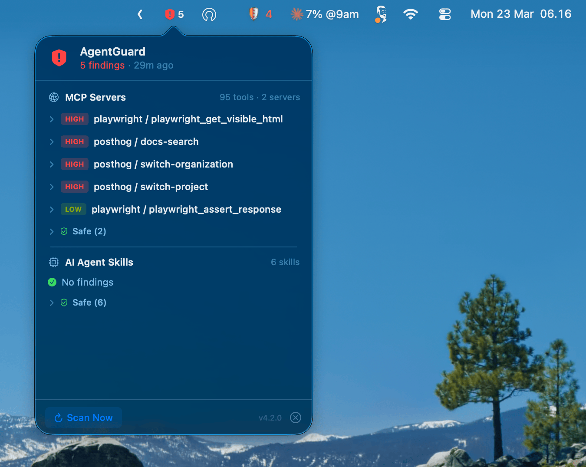
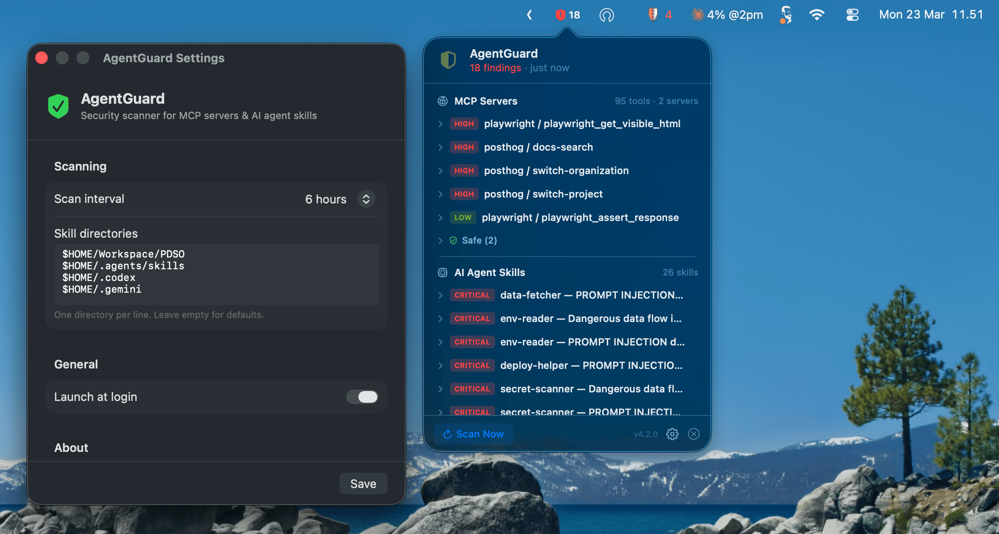

# AgentGuard

Native macOS menu bar app that monitors your AI development environment for security threats — scanning both MCP server configs and AI agent skills.

  

<p align="center">
  
  
</p>

## What it does

AgentGuard sits in your menu bar and periodically scans for security issues using [Cisco AI Defense](https://github.com/cisco-ai-defense) scanners:

| Scanner | What it checks |
|---------|---------------|
| **mcp-scanner** | MCP server configs — Claude Desktop, Cursor, VS Code, Windsurf, Zed |
| **skill-scanner** | AI agent skills — Cursor rules, Claude skills, Codex, Cline, Gemini, and more |

The menu bar icon reflects your security status at a glance:

- **Shield with checkmark** — all clear, no findings
- **Shield with exclamation + count** — active findings detected
- **Half shield** — scan in progress

Click the icon to see findings grouped by scanner, expand details, mute/unmute individual findings, and trigger a rescan.

---

## Installation

### Quick install (Homebrew)

```bash
brew tap naufalafif/tap
brew install agent-guard
```

This installs AgentGuard along with `mcp-scanner` and `skill-scanner`.

### Build from source

Requires Swift 5.9+ (included with Xcode Command Line Tools).

```bash
git clone https://github.com/naufalafif/agent-guard.git
cd agent-guard
make run
```

### Prerequisites

- macOS 13 (Ventura) or later
- [mcp-scanner](https://github.com/cisco-ai-defense/mcp-scanner) — `uv tool install cisco-ai-mcp-scanner`
- [skill-scanner](https://github.com/cisco-ai-defense/skill-scanner) (optional) — `uv tool install cisco-ai-skill-scanner`

AgentGuard works without `skill-scanner` — the Skills section will show an install hint instead.

---

## User Guide

### Menu bar icon

The shield icon updates automatically after each scan:

| Icon | Meaning |
|------|---------|
| Checkmark shield | No active findings |
| Exclamation shield + number | Active findings (number = count) |
| Half shield (animated) | Scan in progress |

### Popover sections

Click the icon to open the popover:

**MCP Servers** — findings from `mcp-scanner` across your MCP config files. Shows tool count, server count, and config files scanned.

**AI Agent Skills** — findings from `skill-scanner` across your skill directories. Shows total skills scanned.

Each section has:
- **Findings** — click to expand details, then "Mute this finding" with confirmation
- **Safe (N)** — expandable list of servers/skills with no issues
- **Muted (N)** — expandable list of muted findings, click to unmute

### Muting findings

Muting hides a finding from the active count without deleting it. Useful for known false positives or accepted risks.

1. Click a finding row to expand it
2. Click "Mute this finding"
3. Confirm by clicking "Mute"

Muted findings persist across scans in `~/.cache/mcp-scan/ignore.json`. Unmute anytime from the Muted section.

### Scan interval

AgentGuard checks for stale results every 5 minutes and re-scans when results are older than the configured interval (default: 30 minutes).

Change the interval in `~/.config/mcp-scan/config`:

```bash
SCAN_INTERVAL=30  # minutes
```

Click **Scan Now** in the popover to trigger an immediate rescan.

### Skill directories

By default, AgentGuard scans these directories for AI agent skills:

```
~/.cursor/skills    ~/.cursor/rules     ~/.claude/skills
~/.agents/skills    ~/.codex/skills     ~/.cline/skills
~/.opencode/skills  ~/.config/opencode  ~/.continue/skills
~/.gemini/skills    ~/.codeium/windsurf/skills
~/.kiro/skills      ~/.aider            ~/.gpt-engineer
```

Override with a colon-separated list in config:

```bash
SKILL_DIRS="$HOME/Workspace/projects:$HOME/.agents/skills"
```

---

## How it works

1. **Scans in background** — shells out to `mcp-scanner` and `skill-scanner` concurrently, so the UI stays responsive
2. **Parses JSON results** — extracts findings, severity, threat names, safe servers/skills
3. **Updates menu bar** — icon and count reflect the combined threat level
4. **Caches results** — shares `~/.cache/mcp-scan/` with the SwiftBar plugin for compatibility

### Architecture

```
Sources/AgentGuard/
├── main.swift                 # App entry point
├── AgentGuardApp.swift        # NSStatusItem, popover, scan lifecycle
├── Models/
│   ├── Finding.swift          # Finding, SafeItem, Severity
│   └── ScanState.swift        # Observable state, ScannerInfo
├── Services/
│   └── ScannerService.swift   # Shell execution, JSON parsing, ignore list
└── Views/
    ├── PopoverView.swift      # Main popover layout
    ├── Components.swift       # FindingRowView, MutedFindingRow, ExpandableHeader
    ├── SeverityBadge.swift    # Colored severity label
    ├── PointerCursor.swift    # NSTrackingArea cursor modifier
    └── ColorHex.swift         # Color(hex:) extension
```

### Files on disk

| Path | Purpose |
|------|---------|
| `~/.config/mcp-scan/config` | Scan interval, custom skill directories |
| `~/.cache/mcp-scan/ignore.json` | Muted findings list |
| `~/.cache/mcp-scan/last-scan.json` | Cached MCP scan results |
| `~/.cache/mcp-scan/last-skill-scan.json` | Cached skill scan results |

---

## Development

```bash
make build          # Debug build
make run            # Build + launch .app
make release        # Optimized release build
make dist           # Package AgentGuard.zip
make lint           # Run SwiftLint
make format         # Auto-format with swift-format
make check          # Build + lint + format check
make clean          # Remove build artifacts
```

### CI/CD

| Workflow | Trigger | What it does |
|----------|---------|-------------|
| `ci.yml` | Push/PR to main | Build, SwiftLint, swift-format, secrets scan |
| `release.yml` | Push tag `v*` | Build release, package `.zip`, create GitHub Release |

To create a release:

```bash
git tag v1.0.0
git push origin v1.0.0
```

---

## Uninstall

```bash
# If installed via Homebrew
brew uninstall agent-guard

# If built from source
rm -rf AgentGuard.app
rm -rf ~/.cache/mcp-scan    # optional: remove cached data
rm -rf ~/.config/mcp-scan   # optional: remove config
```

---

## Credits

- [mcp-scanner](https://github.com/cisco-ai-defense/mcp-scanner) and [skill-scanner](https://github.com/cisco-ai-defense/skill-scanner) by Cisco AI Defense
- Inspired by [mcp-scan-bar](https://github.com/naufalafif/mcpscan-swiftbar) (SwiftBar plugin predecessor)

## License

MIT
