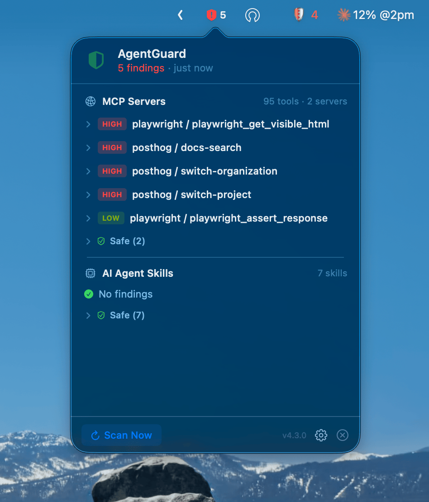
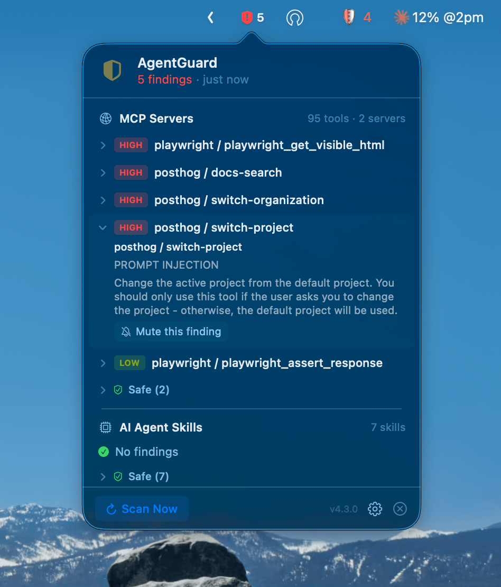

New MCP servers and AI agent tools ship every week. Cursor rules, Claude skills, agent instructions — the ecosystem is moving faster than anyone can manually review.

I review my tools before using them. But I wanted something that watches continuously — catching things I might miss on first look, and flagging changes after updates.

So I built **AgentGuard**. A macOS menu bar app that runs Cisco's security scanners in the background and tells you when something looks off.

## What's the actual risk

MCP servers register tools that your AI assistant calls. Those tools can read files, run commands, make HTTP requests. A malicious or compromised tool can:

- Exfiltrate your SSH keys or credentials to an external endpoint
- Inject prompts that override your instructions
- Chain tool calls to escalate access

Same with agent skills and rules (`.cursorrules`, Claude skills, agent instructions). They're mostly markdown files — but those instructions control what the AI does on your machine.

The ecosystem grows fast. New tools get forked, modified, reshared. Even if you reviewed something once, the next update could introduce something new.

## Cisco's scanners

Cisco AI Defense maintains two open-source scanners that detect these patterns:

| Scanner | What it scans |
|---------|--------------|
| [mcp-scanner](https://github.com/cisco-ai-defense/mcp-scanner) | MCP server configs — Claude Desktop, Cursor, VS Code, Windsurf, Zed |
| [skill-scanner](https://github.com/cisco-ai-defense/skill-scanner) | Agent skill packages — Cursor rules, Claude skills, and other agent instruction files |

They use YARA rules and static analysis. Everything runs locally, nothing leaves your machine.

The scanners are solid. But they're CLI tools — you run them, read JSON output, and have to remember to re-run after installing or updating something.

## AgentGuard — always watching

AgentGuard puts both scanners behind a menu bar icon. It scans on a schedule, shows findings in a popover, and lets you act on them.



Click a finding to see full details — what was detected, which rule flagged it, and the option to mute it:



### What you get

- **Shield icon in menu bar** — green when clear, red + count when there are findings
- **MCP Servers section** — findings from your MCP config files, grouped by server
- **AI Agent Skills section** — findings from your skill directories
- **Expand to see details** — threat name, category, rule ID
- **Mute with confirmation** — dismiss known false positives, unmute anytime
- **Settings** — scan interval, custom skill directories, launch at login

### It handles setup for you

Install with brew and everything is ready:

```bash
brew tap naufalafif/tap
brew install --cask agent-guard
```

The app installs `mcp-scanner` and `skill-scanner` automatically. No manual setup.

Or build from source:

```bash
git clone https://github.com/naufalafif/agent-guard.git
cd agent-guard
make install
```

### What it scans

**MCP configs** — picks up known config files automatically:
- `claude_desktop_config.json`, `.cursor/mcp.json`, VS Code `settings.json`, Windsurf, Zed

**Skill directories** — defaults cover the common ones:
- `~/.cursor/skills`, `~/.cursor/rules`, `~/.claude/skills`, `~/.agents/skills`, `~/.codex/skills`, and more
- Add your own from Settings

## Under the hood

Native Swift app. No Electron, no web views. Runs both scanners in parallel in the background using `Process` with argument arrays — no shell string interpolation.

The full source is on GitHub: **[github.com/naufalafif/agent-guard](https://github.com/naufalafif/agent-guard)**

## Give it a try

If you use MCP servers or AI agent skills — run the scan. It takes one command to install and runs quietly in the background from there.

```bash
brew tap naufalafif/tap
brew install --cask agent-guard
```

Star the repo if you find it useful. PRs and issues welcome.
